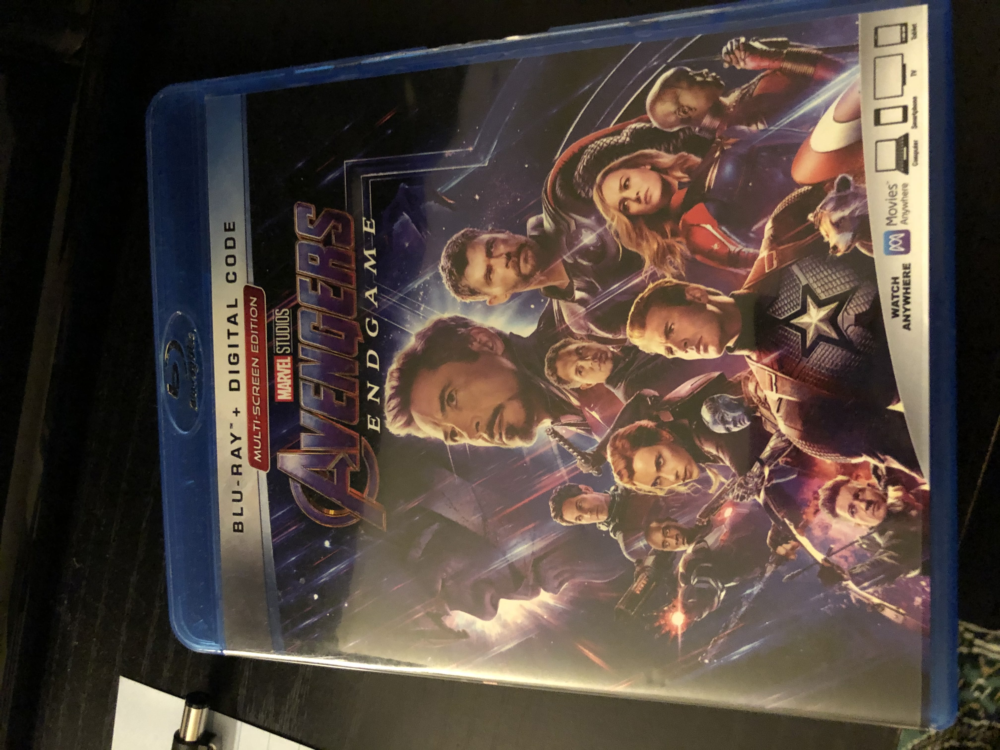

# AvengersPad
 
Welcome users, this is a iOS AR application that displays a video of a detected image. In this case, the iPhone is searching for the cover of the recent Avengers Endgame movie. Once it has detected a matching cover, a mp4 video is displayed above the cover via a plane. 

Preview below: 


# Inspiration 

I got this idea from dream about wearing google glasses and seeing a large billboard with the video being displayed in front of it. After a little research and dedication, I decided to try to make it into reality by creating the next best thing. Using Apple's AR kit, the cover is scanned and the video is shown as in augmented reality. 

# Getting Started 

Important Note: Due to the video and image size for this project, I am only using the Avengers Endgame blu ray cover and the trailer video for this project. Other movies can be included using the same technique but would require their own image and video. 

Once the app is opened, the camera will start searching for the image stored in it's asset's file (image further down this readme). Once the image is found, a plane will appear above the image along with a mp4 video of the trailer for Avengers Endgame. I have a great time making this app and the same process can be used for various other movies. 

### Prerequisites 

This AR project can only be viewed on an actual iPhone and will not work on the simulator. 

# Built With 

- Swift
- ARKit 
- Online Converter
- YouTube video downloader

# Code Snippets

Once the app opens, the iPhone is looking for the following image that is stored in the backend. 




Once the image is scanned, the following set of code is run to render a 3d plane with a mp4 video of the trailer of the movie is displayed. 

```
if let imageAnchor = anchor as? ARImageAnchor {
            
            let videoNode = SKVideoNode(fileNamed: "marvel.mp4")
            
            videoNode.play()
            
            let videoScene = SKScene(size: CGSize(width: 480, height: 360))
            
            videoNode.position = CGPoint(x: videoScene.size.width / 2, y: videoScene.size.height/2)
            
            videoNode.yScale = -1.0
            
            videoScene.addChild(videoNode)
            
            let plane = SCNPlane(width: imageAnchor.referenceImage.physicalSize.width, height: imageAnchor.referenceImage.physicalSize.height)
            
            plane.firstMaterial?.diffuse.contents = videoScene
            
            let planeNode = SCNNode(geometry: plane)
            
            planeNode.eulerAngles.x = -.pi/2
            
            node.addChildNode(planeNode)
        }
```

The code above first creates a video node that is set with the size of the actual blu ray cover and is also set to play when the image is detected. Once the size is setup, the video node is added to the main plane node that is above the detected the blu ray cover and has it's own size related to the cover's size. After these two steps, the node is returned and renders the video.


# Author
**Muhammad** - https://github.com/mawais54013